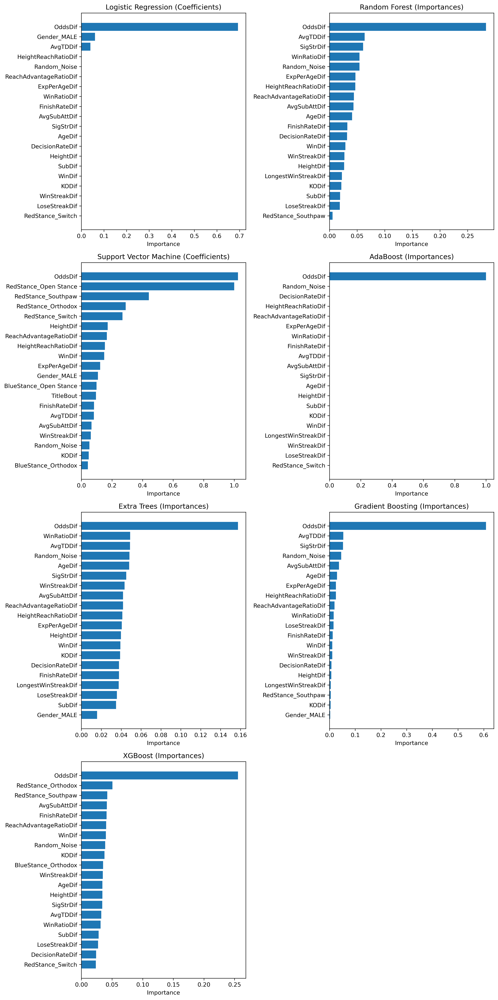
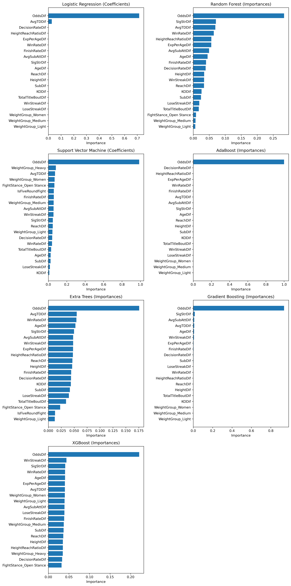
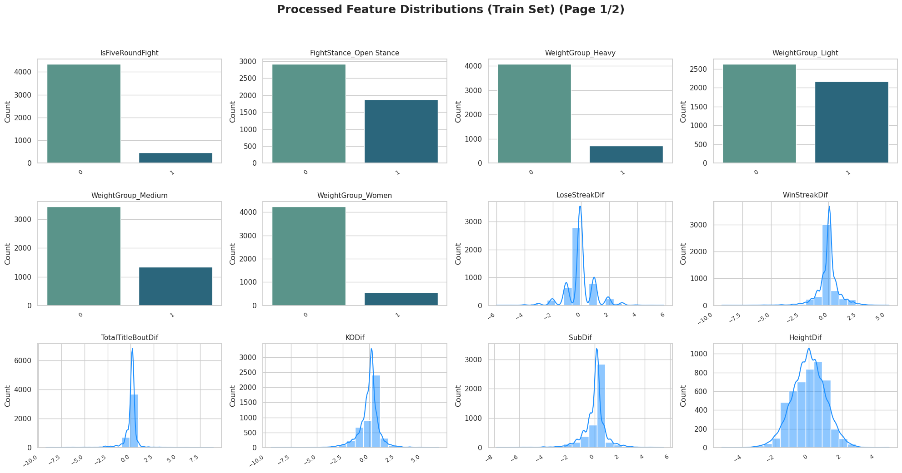
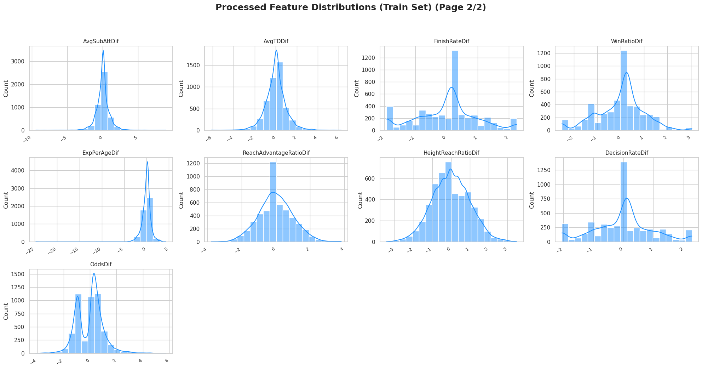

<h1 align="center">
  🥋 UFC Fight Predictor Model
  
</h1>

## 📝 Project Summary
UFC Fight Predictor is a machine learning pipeline developed to predict the outcomes of UFC fights by combining fighter statistics, performance history, and betting market signals. Integrating classical models, boosted ensembles, and neural networks, the project achieves an accuracy of approximately 66% — a level that reflects the inherent unpredictability and stochastic nature of MMA competition. The pipeline strikes a balance between predictive performance and interpretability, providing valuable insights into the key factors that influence fight outcomes.

---

## 🎯 Objective

This project aims to build a robust **binary classification model** to predict the winner of a UFC fight. The model estimates whether **Fighter Red** or **Fighter Blue** is more likely to win based on differences in physical attributes, fighting styles, and recent performances.

By transforming fighter-level data into **relative feature vectors**, the model learns from historical outcomes and generalizes effectively to future matchups.

---

## 📊 Dataset Description

The dataset includes detailed information on historical UFC fights. Each row represents a single bout with features combining:

- 🧍‍♂️ **Numerical attributes** (e.g., height, reach, age)
- 🎯 **Categorical encodings** (fighting style: ortodox, southpaw, switch, fight stance: open, closed, weight classes.)
- 📈 **Performance indicators** (e.g., striking landed per minute, average takedown attempts)

All features are encoded *relatively*:
$$x = fighter_{blue} - fighter_{red}$$

### Key Feature Groups

- **Fighter Attributes**: Height, reach, weight class, stance, age.  
- **Style & Stance**: One-hot encoded during preprocessing.  
- **Performance Metrics**: Strikes per minute, accuracy, takedown attempts.  
- **Recent Form**: Win/loss streaks, odds. 

### 🎯 Target Variable:
- **0** → Fighter Red wins  
- **1** → Fighter Blue wins  

---

## 🛠️ Modeling Approach

The modeling pipeline is structured into three interconnected stages, designed to maximize predictive performance while ensuring interpretability and robustness, all preprocessing, feature engineering, and data splitting is handled via the modular UFCData class, ensuring consistent transformations across training and evaluation. All models are wrapped and evaluated through the UFCModel class.

1. **🔧 Feature Engineering**
   - Fighter data is transformed into **relative differences** between Blue and Red fighters, capturing key attributes such as height, reach, age, striking metrics, grappling performance, and win streaks.
   - Categorical variables (e.g., stance, fighting style, weight class) are one-hot encoded — binary categories use compact encoding, while multiclass variables retain full dummy representations.
   - Numerical features are standardized using scalers fitted exclusively on the training set to prevent data leakage.
   - Additional engineered features capture recent activity patterns, such as experience-per-age ratio (total rounds fought divided by age), win-by-decision rate difference, and win-by-finish rate difference.
   - Feature selection is informed by correlation analysis, aiming to minimize redundancy while preserving predictive signal.
   - A synthetic random noise feature (`Random_Noise`) is introduced as a baseline to assess feature importance. Different combinations were explored until the random column gained prominence, guiding the final selection. This iterative process resulted in a feature set that balances complexity, interpretability, and predictive power.

2. **🤖 Model Training**
   - A diverse suite of machine learning models is trained, combining **classical algorithms**, **boosted ensemble methods**, and **deep learning architectures**.
   - The task is framed as a binary classification problem, with a baseline distribution of approximately 58% red corner wins, reflecting historical outcome imbalance.
   - Hyperparameter tuning is systematically conducted in the notebook `04-training.ipynb` using `GridSearchCV`, with detailed parameter grids defined for each model. This exploration includes models such as XGBoost, SVM, Random Forest, AdaBoost, and Neural Networks, optimizing performance across algorithmic families.

3. **📊 Evaluation**
   - Model performance is assessed using a comprehensive set of metrics, computed via the modular `metrics.py` implementation:
     - **Accuracy** (0–1, higher is better): Overall proportion of correct predictions.
     - **Precision** (0–1, higher is better): Share of positive predictions that are actually correct.
     - **Recall** (0–1, higher is better): Share of true positives correctly identified.
     - **F1 Score** (0–1, higher is better): Harmonic mean of precision and recall, balancing both.
     - **ROC-AUC** (0.5–1, higher is better): Probability that the model ranks a random positive higher than a random negative.
     - **Brier Score** (0–1, lower is better): Mean squared error between predicted probabilities and actual outcomes, reflecting calibration.
   - Confusion matrices are used to visualize classification performance across true and false positives and negatives.
   - The framework supports automated multi-model comparison, enabling the identification of top-performing models per metric and facilitating robust benchmarking.

---

## 🤖 Models Implemented

The following classifiers have been integrated and carefully tuned, all coordinated through the modular `model_factory.py` pipeline, enabling systematic benchmarking and performance optimization:

- 🔹 **Classical Models**
  - ✅ **K-Nearest Neighbors (KNN)**: Classifies based on proximity to neighboring points in feature space.
  - ✅ **Support Vector Machine (SVM)**: Effective in high-dimensional, binary classification tasks.
  - ✅ **Logistic Regression**: Linear classifier with probabilistic outputs.
  - ✅ **Naive Bayes**: Probabilistic model suited for high-dimensional feature spaces.
  - ✅ **Quadratic Discriminant Analysis (QDA)**: Assumes Gaussian class-conditional distributions.

- 🔹 **Ensemble Methods**
  - ✅ **Random Forest**: Bagging ensemble of decision trees, providing robustness and low variance.
  - ✅ **Extra Trees**: Randomized ensemble variant of Random Forest, enhancing variance reduction.

- 🔹 **Boosted Ensemble Models**
  - ✅ **AdaBoost**: Sequentially combines weak learners to focus on difficult samples.
  - ✅ **Gradient Boosting**: Iteratively builds additive models to minimize prediction error.
  - ✅ **XGBoost**: Highly optimized gradient boosting with regularization, parallelism, and advanced hyperparameter tuning.

- 🔹 **Deep Learning**
  - ✅ **Neural Networks (MLP)**: Multi-layer perceptron capable of capturing complex, non-linear relationships.

---

## 🧪 Project Structure

```bash
ufc-predictor/
├── app/                              # Apps for execution and deployment
│   ├── __init__.py                   # Common initialization (empty or shared setup)
│   ├── app_cli.py                    # Interactive console mode
│   └── app_streamlit.py              # Visual dashboard (optional)
├── app.py                            # Main entry point
├── data/
│   ├── raw/                          # Original fight data
│   ├── processed/                    # Cleaned and transformed datasets
│   └── results/                      # Evaluation logs, metrics, model reports
├── notebooks/
│   ├── 01-etl.ipynb                  # Data extraction and cleaning
│   ├── 02-eda.ipynb                  # Exploratory Data Analysis
│   ├── 03-feature_engineering.ipynb  # Feature engineering using UFCData
│   ├── 04-training.ipynb             # Model training using the training set
│   ├── 05-model_experiments.ipynb    # Model comparison and results analysis
│   └── 06-deployment.ipynb           # Deployment exploration and integration
├── src/
│   ├── config.py                     # Model hyperparameters and registry
│   ├── data.py                       # UFCData class: manages data splits and transformations
│   ├── helpers.py                    # Utility and preprocessing functions
│   ├── io_model.py                   # Save/load model objects from disk
│   ├── metrics.py                    # Evaluation metrics and plots
│   ├── model.py                      # UFCModel class: Wrapper class for saving, loading, and evaluating models
│   ├── model_factory.py              # Central model selection logic
│   └── predictor.py                  # UFCPredictor class: interactive fight prediction interface
├── docs/                             # Markdown documentation per model
├── img/                              # Images for plots, logos, and visuals
└── requirements.txt                  # Project dependencies

```

---

## 🔬 Noise-Based Feature Selection

To improve feature selection, we conducted a **Noise-Based Feature Selection** experiment. A synthetic random feature (`Random_Noise`) was added to the dataset using `UFCData.add_random_feature()`, and feature importance was analyzed across multiple models. Any real feature showing lower importance than the random column was considered uninformative and a candidate for exclusion.

This iterative process helped refine the feature set, striking a balance between **model complexity, interpretability, and predictive performance**.  
**Below: on the left, feature importances with the random noise benchmark; on the right, after applying several feature engineering refinements, with the random noise column removed:**

<p align="center">
  
  
</p>

---

### 🧠 Feature Importance Analysis

The final feature importance analysis, aggregated across all models, reveals consistent patterns:

- **Top features:**  
  `OddsDif` stands out as the most influential feature across all models, both linear and tree-based, reflecting the predictive strength embedded in betting odds and the prior knowledge priced by the market. `WinRatioDif` and `SigStrDif` follow as key secondary features, capturing fighter performance history and striking effectiveness.

- **Mid-level features:**  
  Grappling-related variables like `AvgTDDif` and `AvgSubAttDif` show moderate importance, particularly in tree-based models. Weight category indicators (e.g., `WeightGroup_Heavy`) also contribute meaningfully in XGBoost and Gradient Boosting, aligning with the known higher KO power and fight-ending potential in heavier divisions.

- **Low-importance features:**  
  Variables such as `ReachAdvantageRatioDif`, `HeightReachRatioDif`, `SubDif`, `KODif`, and `LoseStreakDif` consistently rank at the bottom across models, suggesting limited predictive contribution in the current setup.

- **Model-specific patterns:**  
  Linear models (e.g., Logistic Regression, SVM) heavily rely on `OddsDif`, while ensemble and boosted models (e.g., Random Forest, XGBoost) balance performance metrics, weight groups, and historical stats.

This analysis highlights that while betting odds carry strong baseline predictive power, adding well-engineered sports performance features enhances model robustness and interpretability.

## 📈 Model Performance Summary

The table below summarizes the main evaluation metrics for all trained models (values computed via `metrics.py` and experiment logs):

| Model                      | Accuracy | Precision | Recall  | F1 Score | ROC-AUC | Brier Score |
|----------------------------|----------|-----------|---------|----------|---------|-------------|
| Logistic Regression        | 0.6595   | 0.6112    | 0.5179  | 0.5607   | 0.7132  | 0.2146      |
| Random Forest              | 0.6536   | 0.6302    | 0.4226  | 0.5059   | 0.7073  | 0.2167      |
| Support Vector Machine     | 0.6578   | 0.6064    | 0.5258  | 0.5632   | 0.7119  | 0.2129      |
| K-Nearest Neighbors        | 0.6095   | 0.5467    | 0.4067  | 0.4664   | 0.6381  | 0.2359      |
| AdaBoost                  | 0.6553   | 0.6264    | 0.4425  | 0.5186   | 0.7102  | 0.2126      |
| Naive Bayes               | 0.6278   | 0.5569    | 0.5536  | 0.5552   | 0.6753  | 0.2317      |
| Extra Trees               | 0.6320   | 0.5871    | 0.4147  | 0.4860   | 0.6657  | 0.2249      |
| Gradient Boosting         | 0.6561   | 0.6176    | 0.4742  | 0.5365   | 0.7133  | 0.2107      |
| Quadratic Discriminant Analysis | 0.6486   | 0.5928    | 0.5198  | 0.5539   | 0.6883  | 0.2212      |
| Neural Network           | 0.6603   | 0.6194    | 0.4940  | 0.5497   | 0.7049  | 0.2152      |
| XGBoost                  | 0.6570   | 0.6456    | 0.4048  | 0.4976   | 0.7107  | 0.2152      |

> 📌 *Complete results and additional visualizations can be inspected in `notebooks/05-model_experiments.ipynb`.*

---

### 📊 Metrics Analysis and Predictive Limits

- Across all models, we observe a convergence around ~65% accuracy, with the best models (Neural Network, Logistic Regression, SVM) reaching slightly above 0.65–0.66. This performance plateau suggests that the dataset likely has limited additional predictive power beyond what is already captured by the current features and models.

- It is important to highlight the inherent stochasticity of UFC fights: combat sports are highly dynamic and often unpredictable. A useful mental exercise is to imagine the same two fighters facing each other on different days—the outcome could realistically flip depending on minor factors, strategy, or randomness. This sets a natural upper bound for predictive performance, beyond which even the best models cannot generalize reliably.

- Metrics like ROC-AUC (~0.71 for top models) indicate that the models do have meaningful discriminative power, but the moderate F1 scores and Brier scores show that prediction confidence and calibration are far from perfect. Additionally, the drop in recall across many models (especially tree-based ones) suggests that they tend to favor the majority class or struggle with edge cases.

In summary, while machine learning models can extract useful patterns from fighter stats and historical data, the chaotic nature of MMA limits deterministic prediction accuracy, making ~66% a realistic ceiling under the current setup.

## 🧩 Feature Descriptions

| Feature Name               | Description                                                                                                   |
|---------------------------|-------------------------------------------------------------------------------------------------------------|
| FightStance_Open Stance    | Indicator if the fight is an open-stance matchup (i.e., fighters have different stances, such as orthodox vs southpaw)                                  |
| WeightGroup_Heavy         | Indicator if the fight involves a heavyweight fighter (Light Heavyweight or Heavyweight) (Blue vs Red).      |
| WeightGroup_Light         | Indicator if the fight involves a lightweight fighter (Flyweight, Bantamweight, Featherweight, Lightweight) (Blue vs Red). |
| WeightGroup_Medium        | Indicator if the fight involves a middleweight fighter (Welterweight, Middleweight) (Blue vs Red).          |
| WeightGroup_Women        | Indicator if the fight involves a women's division fighter (Women’s Flyweight, Strawweight, Bantamweight, Featherweight) (Blue vs Red). |
| LoseStreakDif            | Difference in current losing streaks (Blue - Red).                                                          |
| WinStreakDif            | Difference in current winning streaks (Blue - Red).                                                        |
| KODif                  | Difference in number of KO/TKO wins (Blue - Red).                                                           |
| SubDif                 | Difference in number of submission wins (Blue - Red).                                                      |
| HeightDif              | Difference in fighter height (cm, Blue - Red).                                                              |
| AgeDif                 | Difference in fighter age (years, Blue - Red).                                                             |
| SigStrDif             | Difference in significant strikes per minute (Blue - Red).                                                  |
| AvgSubAttDif         | Difference in average submission attempts per 15 minutes (Blue - Red).                                       |
| AvgTDDif            | Difference in average takedown attempts per 15 minutes (Blue - Red).                                         |
| FinishRateDif        | Difference in finish rate (KO + Submission + TKO Doctor Stoppage wins / total fights, Blue - Red).         |
| WinRatioDif         | Difference in win ratio (wins / [wins + losses], Blue - Red; safeguard applied for zero division).         |
| ExpPerAgeDif        | Difference in experience per age (total rounds fought divided by age, Blue - Red).                         |
| ReachAdvantageRatioDif | Difference in reach advantage ratio (reach in cm, Blue / Red).                                              |
| HeightReachRatioDif  | Difference in height-to-reach ratio (height/reach, Blue - Red).                                              |
| DecisionRateDif      | Difference in decision win rate (wins by decision / total wins, Blue - Red; safeguard applied for zero division). |
| OddsDif             | Difference in betting odds (Blue odds - Red odds; lower values favor the fighter).                           |

---

<p align="center">
  
</p>

<p align="center">
  
</p>

## 🚀 Getting Started

To run the pipeline locally:

1. **Clone the repository**

```bash
git clone https://github.com/mfourier/ufc-predictor.git
cd ufc-predictor
```

2. **Install dependencies**

```bash
pip install -r requirements.txt
```

3. **Run the notebooks** Start from `notebooks/01-etl.ipynb` and proceed step by step through to `05-model_experiments.ipynb`.

---

## 📚 Documentation

Comprehensive project documentation is available in the `docs/` folder, covering:

- **Model overviews and mathematical formulations**: Detailed descriptions of each algorithm, including underlying principles and expected behavior.
- **Key assumptions and limitations**: Insights into when and why each model performs best, as well as potential pitfalls.
- **Hyperparameter grids**: Full parameter configurations used for tuning with `GridSearchCV`, enabling reproducibility and extension.
- **Training logs**: A CSV file automatically generated during experiments, storing key metrics, best hyperparameters, and training durations for each model, enabling result tracking and comparison across runs.
- **Usage guides**: Step-by-step instructions on running the notebooks, customizing experiments, and interpreting results.

---

## 👥 Contributors

- **Maximiliano Lioi** — M.Sc. in Applied Mathematics @ University of Chile
- **Rocío Yáñez** — M.Sc. in Applied Mathematics @ University of Chile

---

## 🙏 Acknowledgements

We thank [shortlikeafox](https://github.com/shortlikeafox/ultimate_ufc_dataset) for their excellent work compiling the UFC dataset used as the foundation of this project. Their contribution made it possible to train and evaluate predictive models on historical fight outcomes.

---
