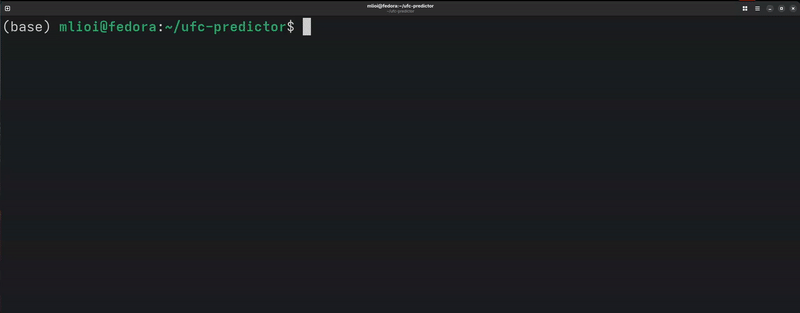
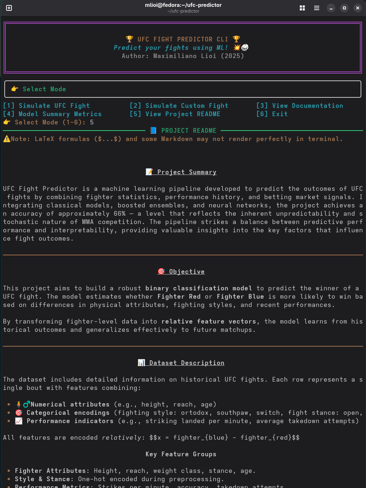

<h1 align="center">
  🥋 UFC Fight Predictor
  
</h1>

<p align="center">
  
  
  
</p>

## 📝 Project Summary
UFC Fight Predictor is a machine learning pipeline developed to predict the outcomes of UFC fights by combining fighter statistics, performance history, and betting market signals. Integrating classical models, boosted ensembles, and neural networks, the project achieves an accuracy around 66% — which aligns with the inherent unpredictability and stochastic nature of MMA competition. The pipeline strikes a balance between predictive performance and interpretability, providing valuable insights into the key factors that influence fight outcomes.

---

## ⚡ Quick Start with UFC Fight Predictor CLI
🐧 For Unix/macOS:
```bash
git clone https://github.com/mfourier/ufc-predictor.git
cd ufc-predictor
chmod +x ufc.sh
./ufc.sh
```
🪟 For Windows:
```bash
ufc.bat
```
> Launches the Dockerized CLI App to simulate UFC fights and test models.

<p align="center">
  
</p>

---
<p align="center">
  
  
</p>

## 🎯 Objective

This project aims to build a robust **binary classification model** to predict the winner of a UFC fight. The model estimates whether **Fighter Red** or **Fighter Blue** is more likely to win based on differences in physical attributes, fighting styles, and recent performances.

By transforming fighter-level data into **relative feature vectors**, the model learns from historical outcomes and generalizes to future matchups.

---

## 📊 Dataset Description

The dataset includes detailed information on historical UFC fights from 2010 to 2024. Each row represents a single bout, with features capturing the relative differences between both fighters in terms of physical attributes, performance history, and betting market data (odds).

- 🧍‍♂️ **Numerical attributes** (e.g., height, reach, age)
- 🎯 **Categorical encodings** (e.g., fighting style: orthodox, southpaw, switch; fight stance: open, closed; weight classes)
- 📈 **Performance indicators** (e.g., striking landed per minute, average takedown attempts)

### Key Feature Groups

- **Fighter Attributes**: Height, reach, weight class, stance, age.  
- **Style & Stance**: One-hot encoded during preprocessing.  
- **Performance Metrics**: Strikes per minute, accuracy, takedown attempts.  
- **Recent Form**: Win/loss streaks, odds. 

### 🎯 Target Variable:
- **0** → Fighter Red wins  
- **1** → Fighter Blue wins  

---

## 🛠️ Modeling Approach

The modeling pipeline is structured into three interconnected stages, designed to maximize predictive performance while ensuring interpretability and robustness, all preprocessing, feature engineering, and data splitting is handled via the modular UFCData class, ensuring consistent transformations across training and evaluation. All models are wrapped and evaluated through the UFCModel class.

1. **🔧 Feature Engineering**
   - Fighter data is transformed into **relative differences** between Blue and Red fighters, capturing key attributes such as height, reach, age, striking metrics, grappling performance, and win streaks.
   - Categorical variables (e.g., stance, fighting style, weight class) are one-hot encoded — binary categories use compact encoding, while multiclass variables retain full dummy representations.
   - Numerical features are standardized using scalers fitted exclusively on the training set to prevent data leakage.
   - Additional engineered features capture recent activity patterns, such as experience-per-age ratio (total rounds fought divided by age), win-by-decision rate difference, and win-by-finish rate difference.
   - Feature selection is informed by correlation analysis, aiming to minimize redundancy while preserving predictive signal.
   - A synthetic random noise feature (`Random_Noise`) is introduced as a baseline to assess feature importance. Different combinations were explored until the random column gained prominence, guiding the final selection. This iterative process resulted in a feature set that balances complexity, interpretability, and predictive power.

2. **🤖 Model Training**
   - A diverse suite of machine learning models is trained, combining **classical algorithms**, **boosted ensemble methods**, and **deep learning architectures**.
   - The task is framed as a binary classification problem, with a baseline distribution of approximately 58% red corner wins, reflecting historical outcome imbalance.
   - Hyperparameter tuning is systematically conducted in the notebook `04-training.ipynb` using `GridSearchCV`, with detailed parameter grids defined for each model. This exploration includes models such as XGBoost, SVM, Random Forest, AdaBoost, and Neural Networks, optimizing performance across algorithmic families.

3. **📊 Evaluation**
   - Model performance is assessed using a comprehensive set of metrics, computed via the modular `metrics.py` implementation:
     - **Accuracy** (0–1, higher is better): Overall proportion of correct predictions.
     - **Precision** (0–1, higher is better): Share of positive predictions that are actually correct.
     - **Recall** (0–1, higher is better): Share of true positives correctly identified.
     - **F1 Score** (0–1, higher is better): Harmonic mean of precision and recall, balancing both.
     - **ROC-AUC** (0.5–1, higher is better): Probability that the model ranks a random positive higher than a random negative.
     - **Brier Score** (0–1, lower is better): Mean squared error between predicted probabilities and actual outcomes, reflecting calibration.
   - Confusion matrices are used to visualize classification performance across true and false positives and negatives.
   - The framework supports automated multi-model comparison, enabling the identification of top-performing models per metric and facilitating robust benchmarking.

---

## 🤖 Models Implemented

The following classifiers have been integrated and carefully tuned, all coordinated through the modular `model_factory.py` pipeline, enabling systematic benchmarking and performance optimization:

- 🔹 **Classical Models**
  - ✅ **K-Nearest Neighbors (KNN)**: Classifies based on proximity to neighboring points in feature space.
  - ✅ **Support Vector Machine (SVM)**: Effective in high-dimensional, binary classification tasks.
  - ✅ **Logistic Regression**: Linear classifier with probabilistic outputs.
  - ✅ **Naive Bayes**: Probabilistic model suited for high-dimensional feature spaces.
  - ✅ **Quadratic Discriminant Analysis (QDA)**: Assumes Gaussian class-conditional distributions.

- 🔹 **Ensemble Methods**
  - ✅ **Random Forest**: Bagging ensemble of decision trees, providing robustness and low variance.
  - ✅ **Extra Trees**: Randomized ensemble variant of Random Forest, enhancing variance reduction.

- 🔹 **Boosted Ensemble Models**
  - ✅ **AdaBoost**: Sequentially combines weak learners to focus on difficult samples.
  - ✅ **Gradient Boosting**: Iteratively builds additive models to minimize prediction error.
  - ✅ **XGBoost**: Highly optimized gradient boosting with regularization, parallelism, and advanced hyperparameter tuning.

- 🔹 **Deep Learning**
  - ✅ **Neural Networks (MLP)**: Multi-layer perceptron capable of capturing complex, non-linear relationships.

<p align="center">
  
  
</p>

## 🧠 Feature Importance Analysis (With vs. Without Odds)

A comparative analysis of feature importance across models trained **with** and **without** betting odds reveals key shifts in predictive behavior.

### 🔍 Models Trained Without Odds

Models that exclude betting odds rely more heavily on **physical attributes** and **technical performance metrics** to make predictions.

- **Top recurring features:**
  - `ReachDif`, `HeightReachRatioDif`, `AgeDif`, `AvgTDDif`, `SigStrDif`
  - Indicators of experience and momentum: `RedTotalFights`, `WinStreakDif`, `RedWinRatio`

- **Key observations:**
  - Linear models like Logistic Regression and SVM rank `ReachDif` and `HeightReachRatioDif` among the most important coefficients.
  - Tree-based models (Random Forest, Extra Trees, Gradient Boosting) distribute importance across age, striking, grappling, and fight history.
  - Features related to underdog performance (e.g., `BlueFinishRate`, `BlueKOPerFight`) appear less prominently, reflecting the difficulty of modeling surprise outcomes without external priors.

---

### 🔍 Models Trained With Odds

Once the feature `OddsDif` is introduced (capturing the difference in betting odds between fighters), the importance landscape changes dramatically.

- **Top feature across all models:**
  - ✅ `OddsDif` is by far the **most important feature**, dominating both linear and tree-based models.
    - In Gradient Boosting and XGBoost, `OddsDif` alone accounts for more than **50%** of total importance.

- **Secondary features:**
  - `AgeDif`, `SigStrDif`, `AvgTDDif`, `ReachDif`, `RedSubPerFight`, `RedWinRatio`, `BlueKOPerFight`

- **Key observations:**
  - Linear models assign extremely high coefficients to `OddsDif`, reducing reliance on all other features.
  - Tree-based models still incorporate performance metrics, but `OddsDif` consistently sits at the top.
  - The introduction of betting odds tends to **stabilize** model performance and shift attention away from nuanced technical details.

---

### 🧩 Conclusion

- Without odds, models must infer advantage purely from physical and statistical differences between fighters.
- With odds, models gain access to a **powerful proxy of market knowledge**, which reflects public perception, fighter form, injury rumors, and expert insights—all aggregated into a single feature.
- This results in higher predictive accuracy and more calibrated outputs, but also **reduces model reliance on handcrafted features**.

> Betting odds act as a real-world prior, dramatically enhancing model confidence—but at the cost of reduced interpretability and generalization when odds are unavailable.


## 📈 Model Performance Summary

The table below summarizes the main evaluation metrics for all trained models (values computed via `metrics.py` and experiment logs):

## 📊 Model Performance Summary

| Model                        | Accuracy | Balanced Accuracy | Precision Red | Recall Red | F1 Red | Precision Blue | Recall Blue | F1 Blue | F1 Macro | ROC AUC | Brier Score | MCC    | Kappa  |
|-----------------------------|----------|-------------------|----------------|------------|--------|----------------|-------------|---------|----------|---------|--------------|--------|--------|
| Logistic Regression         | 0.6636   | 0.6459            | 0.6925         | 0.7561     | 0.7229 | 0.6136         | 0.5357      | 0.5720  | 0.6475   | 0.7145  | 0.2138       | 0.2989 | 0.2970 |
| Random Forest               | 0.6669   | 0.6430            | 0.6840         | 0.7920     | 0.7340 | 0.6320         | 0.4940      | 0.5546  | 0.6443   | 0.7062  | 0.2142       | 0.3006 | 0.2049 |
| Support Vector Machine      | 0.6669   | 0.6499            | 0.6962         | 0.7561     | 0.7249 | 0.6171         | 0.5437      | 0.5781  | 0.6515   | 0.7142  | 0.2130       | 0.3064 | 0.3048 |
| K-Nearest Neighbors         | 0.5945   | 0.5688            | 0.6303         | 0.7288     | 0.6760 | 0.5215         | 0.4087      | 0.4583  | 0.5671   | 0.6121  | 0.2415       | 0.1445 | 0.2349 |
| AdaBoost                    | 0.6553   | 0.6258            | 0.6675         | 0.8092     | 0.7315 | 0.6264         | 0.4425      | 0.5186  | 0.6251   | 0.7007  | 0.2173       | 0.2719 | 0.2623 |
| Naive Bayes                 | 0.6170   | 0.6219            | 0.7019         | 0.6500     | 0.6417 | 0.5358         | 0.6528      | 0.5886  | 0.6151   | 0.6618  | 0.2568       | 0.2408 | 0.2367 |
| Extra Trees                 | 0.6370   | 0.6087            | 0.6567         | 0.7848     | 0.7150 | 0.5924         | 0.4325      | 0.5000  | 0.6075   | 0.6575  | 0.2259       | 0.2327 | 0.2258 |
| Gradient Boosting           | 0.6610   | 0.6396            | 0.6840         | 0.7733     | 0.7259 | 0.6174         | 0.5060      | 0.5562  | 0.6410   | 0.7023  | 0.2140       | 0.2901 | 0.2864 |
| Quadratic Discriminant Analysis | 0.6570 | 0.6410          | 0.6908         | 0.7403     | 0.7147 | 0.6013         | 0.5417      | 0.5699  | 0.6423   | 0.6959  | 0.2208       | 0.2870 | 0.2859 |
| Neural Network              | 0.6536   | 0.6433            | 0.6993         | 0.7073     | 0.7033 | 0.5887         | 0.5794      | 0.5840  | 0.6436   | 0.6968  | 0.2172       | 0.2873 | 0.2873 |
| XGBoost                     | 0.6578   | 0.6332            | 0.6765         | 0.7862     | 0.7273 | 0.6189         | 0.4802      | 0.5408  | 0.6340   | 0.7068  | 0.2122       | 0.2806 | 0.2749 |

## 📈 Model Performance Summary (No Odds)

| Model                                | Accuracy | Balanced Accuracy | Precision Red | Recall Red | F1 Red | Precision Blue | Recall Blue | F1 Blue | F1 Macro | ROC AUC | Brier Score | MCC    | Kappa  |
|-------------------------------------|----------|-------------------|----------------|------------|--------|----------------|-------------|---------|----------|---------|--------------|--------|--------|
| Logistic Regression (no_odds)       | 0.6278   | 0.5890            | 0.6377         | 0.8307     | 0.7215 | 0.5973         | 0.3472      | 0.4391  | 0.5803   | 0.6291  | 0.2297       | 0.2045 | 0.1889 |
| Random Forest (no_odds)             | 0.5828   | 0.5450            | 0.6099         | 0.7805     | 0.6847 | 0.5049         | 0.3095      | 0.3838  | 0.5342   | 0.5824  | 0.2412       | 0.1016 | 0.0951 |
| Support Vector Machine (no_odds)    | 0.6278   | 0.5761            | 0.6248         | 0.8981     | 0.7369 | 0.6432         | 0.2540      | 0.3642  | 0.5505   | 0.6276  | 0.2300       | 0.2019 | 0.1660 |
| K-Nearest Neighbors (no_odds)       | 0.5254   | 0.5101            | 0.5886         | 0.6055     | 0.5969 | 0.4318         | 0.4147      | 0.4231  | 0.5100   | 0.5058  | 0.3295       | 0.0203 | 0.0202 |
| AdaBoost (no_odds)                  | 0.6070   | 0.5677            | 0.6240         | 0.8121     | 0.7057 | 0.5544         | 0.3234      | 0.4085  | 0.5571   | 0.6158  | 0.2348       | 0.1555 | 0.1438 |
| Naive Bayes (no_odds)               | 0.5554   | 0.5631            | 0.6468         | 0.5151     | 0.5735 | 0.4768         | 0.6111      | 0.5357  | 0.5546   | 0.6003  | 0.2694       | 0.1249 | 0.1214 |
| Extra Trees (no_odds)               | 0.5853   | 0.5494            | 0.6132         | 0.7733     | 0.6840 | 0.5093         | 0.3254      | 0.3971  | 0.5406   | 0.5851  | 0.2414       | 0.1100 | 0.1039 |
| Gradient Boosting (no_odds)         | 0.6070   | 0.5730            | 0.6295         | 0.7848     | 0.6986 | 0.5482         | 0.3611      | 0.4354  | 0.5670   | 0.6098  | 0.2369       | 0.1610 | 0.1531 |
| QDA (no_odds)                       | 0.6170   | 0.5906            | 0.6454         | 0.7547     | 0.6958 | 0.5570         | 0.4266      | 0.4831  | 0.5895   | 0.6318  | 0.2330       | 0.1915 | 0.1873 |
| Neural Network (no_odds)            | 0.6278   | 0.5802            | 0.6286         | 0.8766     | 0.7322 | 0.6245         | 0.2837      | 0.3902  | 0.5612   | 0.6344  | 0.2291       | 0.2014 | 0.1734 |
| XGBoost (no_odds)                   | 0.6020   | 0.5703            | 0.6287         | 0.7676     | 0.6912 | 0.5371         | 0.3730      | 0.4403  | 0.5657   | 0.5994  | 0.2414       | 0.1527 | 0.1468 |

> 📌 *Complete results and additional visualizations can be inspected in `notebooks/05-model_experiments.ipynb`.*

---

### 📊 Metrics Analysis and Predictive Limits

- To avoid corner-based bias (favoring Red or Blue arbitrarily), all models in this project were tuned using F1 Macro as the primary scoring metric during GridSearchCV. This ensures that the classifier balances performance across both classes — rewarding models that perform well on underdog Blue wins just as much as favorites. This choice is especially important in UFC fights, where class imbalance (e.g., favorites vs. underdogs) can skew metrics like accuracy.

- When comparing models trained with and without betting odds, we consistently observe that the highest predictive performance peaks around 66–67% accuracy for models that include odds (e.g., SVM, Logistic Regression, Random Forest), while no-odds models plateau slightly lower, around 62–63% at best. This gap reinforces the predictive value of market signals, but also confirms a natural ceiling in the dataset's discriminative power.

- Among no-odds models, the best performers (Logistic Regression, Neural Network, QDA) still achieve reasonably high recall for the Red corner (≥0.75), but struggle in correctly identifying Blue wins — as evidenced by low Recall Blue scores (<0.45) and imbalanced F1 scores. This asymmetry reflects the challenges in capturing underdog victories without external priors like odds.

- Across all models, ROC AUC scores range from ~0.60 to 0.71, indicating that while classifiers can separate classes better than chance, the confidence of predictions remains moderate, especially in edge cases. Brier scores, typically between 0.21 and 0.27, also suggest that probability calibration could be improved.

- Most ensemble models (e.g., Random Forest, Extra Trees) show high recall for the Red corner, but their F1 Blue and Precision Blue are low, suggesting a bias toward the majority class — a sign of class imbalance or insufficient feature diversity for upsets.

- Ultimately, combat sports like MMA are inherently stochastic, and outcomes can flip based on unpredictable variables (e.g., game plan, injuries, judging). Even the most optimized ML models are unlikely to consistently exceed ~66% accuracy on such data without introducing richer inputs like stylistic breakdowns, real-time metrics, or temporal context (e.g., training camp quality, layoffs, fight location). While machine learning models can extract useful patterns from fighter stats and historical data, the chaotic nature of MMA limits deterministic prediction accuracy, making ~66% a realistic ceiling under the current setup.

## 🧩 Feature Descriptions

| Feature Name            | Description                                                                                           |
|-------------------------|-----------------------------------------------------------------------------------------------------|
| BlueTotalTitleBouts     | Number of title fights for Blue corner fighter.                                                     |
| RedTotalTitleBouts      | Number of title fights for Red corner fighter.                                                      |
| LoseStreakDif           | Difference in current losing streaks (Blue - Red).                                                  |
| WinStreakDif           | Difference in current winning streaks (Blue - Red).                                                |
| LongestWinStreakDif    | Difference in longest historical win streaks (Blue - Red).                                          |
| KODif                  | Difference in number of KO/TKO wins (Blue - Red).                                                   |
| SubDif                 | Difference in number of submission wins (Blue - Red).                                               |
| HeightDif              | Difference in height (cm, Blue - Red).                                                              |
| ReachDif               | Difference in reach (cm, Blue - Red).                                                               |
| AgeDif                 | Difference in age (years, Blue - Red).                                                              |
| SigStrDif             | Difference in average significant strikes landed per minute (Blue - Red).                           |
| AvgSubAttDif         | Difference in average submission attempts per 15 minutes (Blue - Red).                               |
| AvgTDDif            | Difference in average takedowns landed per 15 minutes (Blue - Red).                                   |
| RedTotalFights         | Total number of fights for Red corner fighter.                                                     |
| BlueTotalFights        | Total number of fights for Blue corner fighter.                                                    |
| FightStance           | Indicator if fighters have same stance (`Closed Stance`) or different (`Open Stance`).             |
| WeightGroup          | Mapped weight class group (e.g., Light, Medium, Heavy, Women).                                      |
| BlueFinishRate        | Finish rate (KO+SUB wins / total fights) for Blue fighter.                                         |
| RedFinishRate         | Finish rate (KO+SUB wins / total fights) for Red fighter.                                          |
| BlueWinRatio          | Win ratio (wins / total fights) for Blue fighter.                                                  |
| RedWinRatio           | Win ratio (wins / total fights) for Red fighter.                                                   |
| HeightReachRatioDif  | Difference in height-to-reach ratio (height/reach, Blue - Red).                                    |
| RedKOPerFight        | KO/TKO wins per fight for Red fighter.                                                             |
| BlueKOPerFight       | KO/TKO wins per fight for Blue fighter.                                                            |
| RedSubPerFight       | Submission wins per fight for Red fighter.                                                         |
| BlueSubPerFight      | Submission wins per fight for Blue fighter.                                                        |
| IsFiveRoundFight     | Indicator if the fight is scheduled as a five-round fight (1 = Yes, 0 = No).                       |
| OddsDif (if used)    | Difference in betting odds (Blue odds - Red odds; lower favors the fighter).                      |


<p align="center">
  
</p>

<p align="center">
  
</p>

<p align="center">
  
</p>

<p align="center">
  
</p>

## 🔬 Noise-Based Feature Selection

To improve feature selection, we conducted a **Noise-Based Feature Selection** experiment. A synthetic random feature (`Random_Noise`) was added to the dataset using `UFCData.add_random_feature()`, and feature importance was analyzed across multiple models. Any real feature showing lower importance than the random column was considered uninformative and a candidate for exclusion.

This iterative process helped refine the feature set, striking a balance between **model complexity, interpretability, and predictive performance**.  
**Below: on the left, feature importances with the random noise benchmark; on the right, after applying several feature engineering refinements, with the random noise column removed:**

<p align="center">
  
  
</p>

---

## 🚀 Getting Started

You can interact with UFC Fight Predictor in two ways:

---

### 🧪 Run the pipeline via notebooks

1. **Clone the repository**

```bash
git clone https://github.com/mfourier/ufc-predictor.git
cd ufc-predictor
```

2. **Install dependencies**

```bash
pip install -r requirements.txt
```

3. **Run the pipeline notebooks**

Follow the workflow step by step:

- `notebooks/01-etl.ipynb` → Data cleaning and preparation  
- `notebooks/02-eda.ipynb` → Exploratory data analysis  
- `notebooks/03-feature_engineering.ipynb` → Feature construction  
- `notebooks/04-training.ipynb` → Model training and tuning  
- `notebooks/05-model_experiments.ipynb` → Evaluation and comparison  
- `notebooks/06-deployment.ipynb` → CLI integration and deployment flow

### 🖥️ Launch the CLI App (Dockerized)

You can simulate UFC fights or build custom matchups using an interactive CLI interface powered by `rich`.

#### ✅ Quick Launch with `ufc.sh`

If you're on Unix/Linux/macOS, use the provided script to build and run the app automatically:

```bash
chmod +x ufc.sh
./ufc.sh
```

This script will:

- Check if the Docker image exists (and build it if necessary)

- Launch the CLI inside a container

- Mount your local models and datasets

🛠️ Manual Docker Usage (Alternative)

1. Build the Docker image
```bash
docker build -t ufc-cli .
```
2. Run the CLI interactively
```bash
docker run -it ufc-cli
```

ℹ️ Make sure the models/ and data/processed/ directories exist and contain your trained models and preprocessed datasets. The CLI will automatically load them.

Once running, the CLI allows you to:

- 🔎 Simulate historical matchups between known fighters

- 🧠 Predict outcomes using multiple models (with or without betting odds)

- 🧪 Create and test custom fight scenarios

- 📈 View model performance metrics and confusion matrices
---

## 🧪 Project Structure

```bash
ufc-predictor/
├── app.py                            # Main entry point
├── data/
│   ├── raw/                          # Original fight data
│   ├── processed/                    # Cleaned and transformed datasets
│   └── results/                      # Evaluation logs, metrics, model reports
├── notebooks/
│   ├── 01-etl.ipynb                  # Data extraction and cleaning
│   ├── 02-eda.ipynb                  # Exploratory Data Analysis
│   ├── 03-feature_engineering.ipynb  # Feature engineering using UFCData
│   ├── 04-training.ipynb             # Model training using the training set
│   ├── 05-model_experiments.ipynb    # Model comparison and results analysis
│   └── 06-deployment.ipynb           # Deployment exploration and integration
├── src/
│   ├── config.py                     # Model hyperparameters and registry
│   ├── data.py                       # UFCData class: manages data splits and transformations
│   ├── helpers.py                    # Utility and preprocessing functions
│   ├── io_model.py                   # Save/load model objects from disk
│   ├── metrics.py                    # Evaluation metrics and plots
│   ├── model.py                      # UFCModel class: Wrapper class for saving, loading, and evaluating models
│   ├── model_factory.py              # Central model selection logic
│   └── predictor.py                  # UFCPredictor class: interactive fight prediction interface
├── docs/                             # Markdown documentation per model
├── img/                              # Images for plots, logos, and visuals
└── requirements.txt                  # Project dependencies

```

---

## 📚 Documentation

Comprehensive project documentation is available in the `docs/` folder, covering:

- **Model overviews and mathematical formulations**: Detailed descriptions of each algorithm, including underlying principles and expected behavior.
- **Key assumptions and limitations**: Insights into when and why each model performs best, as well as potential pitfalls.
- **Hyperparameter grids**: Full parameter configurations used for tuning with `GridSearchCV`, enabling reproducibility and extension.
- **Training logs**: A CSV file automatically generated during experiments, storing key metrics, best hyperparameters, and training durations for each model, enabling result tracking and comparison across runs.
- **Usage guides**: Step-by-step instructions on running the notebooks, customizing experiments, and interpreting results.

---

## 👥 Contributors

- **Maximiliano Lioi** — M.Sc. in Applied Mathematics @ University of Chile
- **Rocío Yáñez** — M.Sc. in Applied Mathematics @ University of Chile

---

## 🚧 What's Next

This project lays the foundation for UFC fight prediction using structured statistics and market signals. Moving forward, we aim to transform it into a **serious betting-grade model** by integrating richer data and more powerful algorithms:

- 🔁 **Upgrade dataset**  
  We are switching to a more comprehensive dataset, including detailed fight-level statistics, injury records, and fighter time-series. This will reduce noise and increase signal for both favorites and underdogs.

- 🧠 **Integrate AutoGluon**  
  Replace classic scikit-learn models with **AutoGluon**, a powerful AutoML framework capable of handling heterogeneous feature types, boosting ensemble performance, and improving calibration — all with minimal tuning.

- 💸 **Towards real-world betting utility**  
  Combine predictive probabilities with betting odds to assess **value bets** and **expected return**, aiming to simulate actual betting strategies (e.g., Kelly criterion, flat betting). This will enable backtesting of UFC betting models in realistic scenarios.

- 🌐 **Deployment roadmap**  
  Evaluate deployment on a lightweight web interface (e.g., Streamlit) and explore future REST API endpoints for remote prediction.

> Stay tuned for **UFC-Predictor v2** — a new chapter focused on generalization, betting ROI, and high-stakes predictive modeling.

---

## 🙏 Acknowledgements

We thank [shortlikeafox](https://github.com/shortlikeafox/ultimate_ufc_dataset) for their excellent work compiling the UFC dataset used as the foundation of this project. Their contribution made it possible to train and evaluate predictive models on historical fight outcomes.

---

### Disclaimer

This project is an independent work for academic and research purposes.  
It is not affiliated with, endorsed by, or sponsored by UFC, Zuffa LLC, or any related entity.  
All trademarks and fight data belong to their respective owners.

